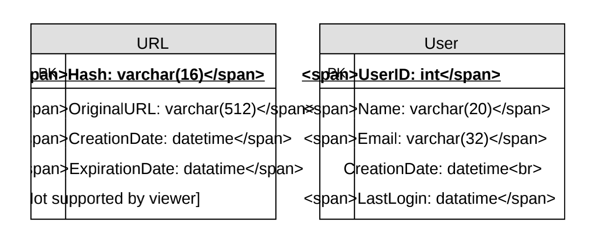

# 1.设计类似TinyURL的短链服务 

> **难度等级:简单**

让我们设计一个像`TinyURL`这样的生成`URL`短链的服务。此服务将提供重定向到长`URL`链接的短别名。类似服务：`bit.ly`, `goo.gl`, `qlink.me`等

## 1.为什么需要URL短链？

`URL`缩短的操作用于为长`URL`创建较短的别名。我们称这些缩短的别名为"短链接"。当用户点击这些短链接时，会重定向到原始`URL`。短链接在显示、打印、发送消息或发推时可节省大量空间。此外，用户不太可能错误键入较短的`URL`。

- 例如，如果我们通过`TinyURL`缩短此这个链接：
  `https://www.educative.io/collection/page/5668639101419520/564905025344512/5668600916475904/`

- 会得到：`http://tinyurl.com/jlg8zpc`

缩短的`URL`大小几乎是实际`URL`大小的三分之一。
`URL`短链服务用于优化跨设备的链接，追踪特定链接以分析受众和活动情况，以及隐藏附属的原始`URL`。
如果你没用过`tinyurl.com`网站在此之前，请尝试创建一个新的短连接的网址，并花一些时间浏览他们的服务提供的各种选项。这对你理解这一章有很大帮助。

## 2.系统的要求和目标

> ***你应该在面试开始的时候明确需求。一定要提问，找出面试官心目中的系统的边界。***

我们的`URL`短链服务应满足以下要求：

**功能性需求:**

- 1.给定一个`URL`，服务应该为它生成一个短且唯一的别名。这称为短链接。

- 2.当用户访问短链接时，服务应该将他们重定向到原始链接。

- 3.用户可以选择为他们的`URL`选择一个自定义的短链接。

- 4.链接将在标准默认时间间隔后过期。用户应该能够指定过期时间。

**非功能性需求：**

- 1.系统应该是高可用的。这是必需的，因为如果我们的服务关闭，所有的`URL`重定向将开始失败。

- 2.`URL`重定向应该以最小的延迟实时发生。

- 3.缩短的链接不应该是可猜测的（不可预测的）。

**扩展性需求：**

- 1.分析；例如，重定向发生了多少次？

- 2.我们的服务也应该可以通过**REST APIS**被其他服务访问。

## 3.容量估算和限制条件

系统读的操作很频繁。与新的`URL`短链生成相比，将有很多重定向请求。假设读写比为`100:1`。

**流量估算**：假设，我们每月将有`500 million`个新的`URL`短链，读/写比率为`100:1`，我们可以预期在同一时期有`50 billion`的重定向：

```java
100*500M=>50B
```

对于我们的系统，每秒查询数（`QPS`）是多少？每秒新`URL`缩短链接服务：

```java
500 millon/（30days*24hours*3600 seconds）= ~200 URL/s
```

考虑到`100:1`的读/写比，每秒的`URL`重定向将是：

```
100 * 200 URLs/s = 20K/s
```

**存储估计**：假设我们将每个`URL`缩短请求（以及相关的缩短链接）存储`5 years`。由于我们预计每月将有`5 million`个新`URL`，因此我们预计存储的对象总数将达到`30 billion`：

```java
500 million * 5 years * 12 months = 30 billion
```

让我们假设每个存储的对象大约有`500 bytes`（只是一个大概的估计，我们稍后会深入研究）。我们需要`15TB`的总存储空间：

```java
30 billion * 500 bytes = 15 TB
```

**带宽估计**：对于写请求，由于我们预计每秒有`200`个新`URL`，因此我们服务的总传入数据将为每秒`100KB`：

```
200 * 500 bytes = 100 KB/s
```

对于读取请求，由于我们预计每秒钟会有`~20K`个`URL`重定向，因此服务的总传出数据将为每秒`10MB`：

```java
20K * 500 bytes = ~10 MB/s
```

**内存估计**：如果我们想缓存一些经常访问的热门`URL`，我们需要多少内存来存储它们？如果我们遵循二八法则，也就是说`20%`的`URL`产生`80%`的流量，我们会缓存这`20%`的热门`URL`。
由于每秒有`20K`个请求，我们每天将收到`1.7 billion`个请求：

```java
20K * 3600 seconds * 24 hours = ~1.7 billion
```

要缓存20%的请求，我们需要170GB的内存。

```java
0.2 * 1.7 billion * 500 bytes = ~170GB
```

这里需要注意的一点是，由于会有很多重复的请求（相同的`URL`），因此，我们的实际内存使用量将小于`170GB`。
**高容量估计**：假设每月有`500 million`个新的`URL`和`100:1`读写比例，以下是我们服务的高容量估计摘要：
新建URL	     `200/s`
URL重定向     `20K/s`
传入数据	     `100KB/s`
传出数据	     `10MB/s`
存储5年           `15TB`
缓存                 `170GB`

## 4.系统API

> ***一旦我们确定了需求，定义系统API总是一个好主意。这应该明确地说明从系统中期望得到什么***。

我们可以使用SOAP或REST APIs来暴露服务接口。以下是用于创建和删除URL的API的定义：

```java
`createURL(api_dev_key, original_url, custom_alias=None, user_name=None,` 
`expire_date=None)
```

**参数：**

- `api_dev_key (string):` 注册帐户的api开发人员密钥。除其他外，这将用于根据分配的配额限制用户
- `original_url (string)`: 原始URL链接
- `custom_alias (string)`: 自定义别名
- `user_name (string)`: 用于编码的用户名
- `expire_date (string)`:过期时间

**返回: (string)**

返回码/错误码

```java
deleteURL(api_dev_key, url_key)
```

- `url_key`表示要检索删除的URL

**如何发现和防止服务被滥用？**恶意用户可以通过使用当前设计中的所有URL使我们瘫痪。为了防止滥用，我们可以通过用户的 `api_dev_key`来限制用户。每个 `api_dev_key.`可以在某个时间段内限制为一定数量的`URL`创建和重定向（每个开发人员密钥可以设置为不同的持续时间）。

## 5.数据库设计

> ***在面试的早期阶段定义DB schema将有助于理解各个组件之间的数据流，之后将指导数据分区。***

关于我们将存储的数据性质的一些现状：

- 1.我们需要储存数十亿条记录。
- 2.我们存储的每个对象都很小（小于1K）。
- 3.除了存储哪个用户创建了`URL`之外，记录之间没有其他关系。
- 4.服务的读操作频繁。

数据库架构：
      我们需要两个表：一个用于存储关于URL映射的信息，另一个用于创建短链接的用户数据。
       

 **我们应该使用什么样的数据库?**  

因为我们预期存储数十亿行，而且我们不需要使用对象之间的关系——像`DynamoDB`、`Cassandra`或`Riak`这样的`NoSQL`键值存储是更好的选择。`NoSQL`选择也更容易扩展。

## 6.基本系统设计与算法

我们在这里要解决的问题是，如何为给定的URL生成一个简短且唯一的`key`。

在第1节的`TinyURL`示例中，缩短的URL是`http://tinyurl.com/jlg8zpc`. 这个`URL`的最后六个字符是我们要生成的短键。我们将探讨两种解决方案：

### a. 实际URL进行加密

我们可以计算给定URL的唯一hash（例如MD5或SHA256等）。然后可以对散列进行编码以进行显示。此编码可以是base36（[a-z，0-9]）或base62（[a-z，a-z，0-9]），如果我们添加`_`和`.`，可以使用base64编码。一个合理的问题是，短键的长度应该是多少？6、8或10个字符。

使用base64编码，一个6个字母长的键将产生`64^6=~68.7 billion`个可能的字符串使用base64编码，一个8个字母长的键将产生`64^8=~281 billion`个可能的字符串和`68.7B`个唯一的字符串，让我们假设6个字母的键对于我们的系统来说就足够了。

如果我们使用MD5算法作为hash函数，它将生成128 bit的hash值。在base64编码之后，我们将得到一个超过21个字符的字符串（因为每个base64字符编码哈希值的6位）。既然我们每个短键只有8个字符的空间，那么我们将如何选择我们的键呢？我们可以用前6（或8）个字母作为key。但这可能会导致key重复，可以从编码字符串中选择其他字符或交换某些字符。

**我们的解决方案有哪些不同的问题？**我们的编码方案有以下几个问题：

- 1.如果多个用户输入相同的URL，他们可以得到相同的缩短URL，这是不可接受的。
- 2.如果部分URL是URL编码的呢？例如`http://www.educative.io/distributed.php?id=design`，以及`http://www.educative.io/distributed.php%3Fid%3design`除了URL编码外，其他都是相同的。

**解决问题的方法**：我们可以在每个输入URL中添加一个递增的序列号，使其唯一，然后生成一个hash。不过，我们不需要在数据库中存储这个序列号。这种方法可能存在的问题是序列号不断增加。会溢出来吗？增加序号也会影响服务的性能。

另一个解决方案是将用户id（应该是唯一的）附加到输入URL。但是，如果用户尚未登录，则必须要求用户选择唯一性key。即使在这之后，如果有冲突，必须不断生成一个key，直到得到一个唯一的。

### b. 离线生成密钥

可以有一个独立的密钥生成服务（KGS），它预先生成随机的六个字母字符串，并将它们存储在数据库中（我们称之为key-DB）。每当想缩短一个URL，将只采取一个已经生成的key，快速有效。我们不仅没有对URL进行编码，而且不必担心重复或冲突。KGS将确保插入key-DB的所有key都是唯一的

**并发会导致问题吗？**一旦key被使用，就应该在数据库中对其进行标记，以确保它不再被使用。如果有多个服务器同时读取密key，则可能会出现两个或多个服务器尝试从数据库中读取相同key的情况。如何解决这个并发问题？

服务器可以使用KGS读取/标记数据库中的key。KGS可以使用两个表来存储密钥：一个用于尚未使用的key，另一个用于所有已使用的key。只要KGS将key提供给其中一个服务器，它就可以将它们移动到used keys表中。KGS总是可以在内存中保存一些key，以便在服务器需要时快速提供它们。

为简单起见，只要KGS在内存中加载一些key，它就可以将它们移动到used keys表中。这样可以确保每个服务器获得唯一的key。如果KGS在将所有加载的key分配给某个服务器之前就失效了，那么我们将浪费这些key-这是可以接受的，因为我们拥有大量的key。

KGS还必须确保不会将同一key提供给多个服务器。为此，它必须同步（或锁定）保存key的数据结构，然后再从中删除key并将其提供给服务器
**key-DB大小是多少？**使用base64编码，我们可以生成`68.7B`唯一的六个字母的key。如果我们需要一个字节来存储一个字母数字字符，我们可以将所有这些key存储在：

```java
6(characters per key)*68.7B(unique keys)=412GB.
```

KGS不是一个单一的失败点吗？是的，是的。为了解决这个问题，我们可以有一个KGS的备用副本。每当主服务器死亡时，备用服务器就可以接管以生成和提供密钥。

每个应用程序服务器都可以缓存密钥数据库中的一些密钥吗？是的，这肯定能加快速度。尽管在这种情况下，如果应用程序服务器在使用所有密钥之前死亡，我们最终将丢失这些密钥。这是可以接受的，因为我们有68B独特的六字母键。

我们如何执行密钥查找？我们可以在数据库或键值存储中查找键来获得完整的URL。如果存在，则向浏览器发出“http302重定向”状态，将存储的URL传递到请求的“Location”字段中。如果我们的系统中不存在该密钥，则发出“http404notfound”状态或将用户重定向回主页。

我们应该对自定义别名施加大小限制吗？我们的服务支持自定义别名。用户可以选择任何他们喜欢的“密钥”，但提供自定义别名不是强制性的。但是，对自定义别名施加大小限制是合理的（而且通常是可取的），以确保我们有一个一致的URL数据库。假设用户可以为每个客户密钥指定最多16个字符（如上面的数据库模式所示）。
URL缩短的高层系统设计


