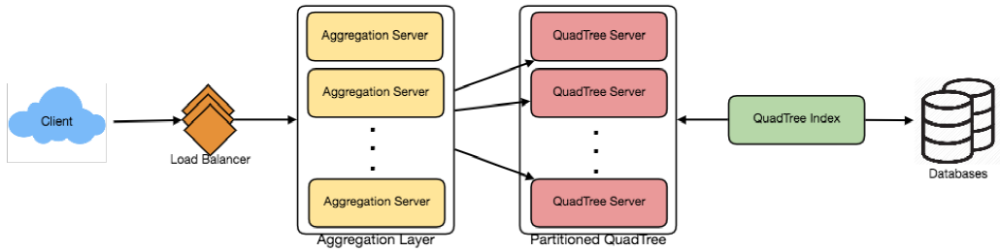

# 13. 设计 Yelp 或附近的朋友

> **难度等级：困难**

让我们设计一个类 Yelp 服务，用户可以搜索附近的饭店、电影院、购物广场等地点，也可以为这些地点添加评论和查看评论。相似服务：临近服务。

## 1. 为什么是 Yelp 或临近服务？

临近服务用于发现附近的吸引事物，如地点、事件等。如果你之前没有用过 [yelp.com](http://yelp.com/)，请在继续阅读之前尝试使用（你可以搜索附近的饭店、电影院等地点），并花一些时间理解网站提供的不同选项。这会对你更好地理解本章内容有极大的帮助。

## 2. 系统的要求和目标

**使用类 Yelp 服务，我们想要达到什么效果**？我们的服务将存储不同地点的信息，使得用户可以搜索这些地点。查询时，我们的服务将返回用户附近的地点列表。

我们的类 Yelp 服务应该满足以下要求：

### 功能性要求

1. 用户应该可以添加/删除/更新地点。

2. 给定用户的地点（经度/纬度），用户应该可以找到在给定半径内的全部附近的地点。

3. 用户应该可以对一个地点添加反馈/评论。反馈可以包含图片、文本或评分。

### 非功能性要求

1. 用户的搜索体验应该是实时的，延迟应该最小化。

2. 我们的服务应该支持高搜索负载。搜索需求将会比添加新地点的需求多很多。

## 3. 容量估算

假设有 5 亿个地点，每秒查询率（QPS）是 10 万。另外假设每年的地点数量和每秒查询率的增长率是 20%。

## 4. 数据库概要

每个地点可以有以下字段：

1. 地点编号（8 个字节）：唯一地确定一个地点；
2. 名称（256 个字节）；
3. 纬度（8 个字节）；
4. 经度（8 个字节）；
5. 描述（512 个字节）；
6. 类别（1 个字节）：例如咖啡店、饭店、电影院等。

虽然一个 4 字节的数字可以唯一地区分 5 亿个地点，考虑到将来的增长，我们使用 8 个字节存储地点编号。

总大小：8 + 256 + 8 + 8 + 512 + 1 => 793 字节

我们也需要存储一个地点的评论、照片和评分。我们可以使用一张独立的表存储地点的评论：

1. 地点编号（8 个字节）；
2. 评论编号（4 个字节）：唯一地识别一条评论，假设任何地点的评论数不超过 2^32；
3. 评论文本（512 个字节）；
4. 评分（1 个字节）：一个地点在十颗星中能获得几颗星。

相似地，我们也可以有独立的表存储地点和评论的照片。

## 5. 系统 API

我们可以使用 SOAP 或 REST API 将我们的服务的函数公开。以下为搜索的 API 的定义：

```
search(api_dev_key, search_terms, user_location, radius_filter, maximum_results_to_return, category_filter, sort, page_token)
```

**参数**：
api_dev_key（string）：一个已注册的帐号的 API 开发者关键字。关键字将和其他字段一起根据用户分配的额度限制用户。
search_terms（string）：一个包含搜索项的字符串。
user_location（string）：执行搜索的用户的地点。
radius_filter（number）：（可选）搜索半径，单位是米。
maximum_results_to_return（number）：返回的商务结果数量。
category_filter（string）：（可选）过滤搜索结果的类别，例如饭店、购物中心等。
sort（number）：（可选）排序模式：最佳匹配（0——默认），最短距离（1）、最高评分（2）。
page_token（string）：该标志表示结果集合中应该返回的页面。

**返回**：（JSON）
一个 JSON 对象，包含匹配搜索语句的商务列表的信息。结果中的每条记录包含商务名称、地址、类别、评分和缩略图。

## 6. 基础系统设计和算法

高阶角度，我们需要存储并索引上文描述的每个数据集合（地点、评论等）。对于查询这个庞大数据库的用户，索引应该是读高效的，因为当用户搜索附近地点时，用户期待实时看到结果。

由于一个地点的位置不会频繁变化，我们不需要担心数据的频繁更新。与此相反，如果我们需要建立的服务中的对象会频繁改变位置，例如人或者出租车，则我们可能会有非常不同的设计。

我们考虑有哪些不同的方式存储数据，并找到最适合我们的使用场景的方法：

### a. SQL 解决方案

一个简单的解决方案是将所有的数据存储在一个数据库中，例如 MySQL。每个地点存储在独立的行中，由地点编号唯一地确定。每个地点的经度和纬度独立存放在不同的两列中，为了快速搜索，两个字段都应该添加索引。

为了找到给定地点 (X, Y) 的半径 D 以内的全部附近地点，我们可以按如下方法查询：

```
Select * from Places where Latitude between X-D and X+D and Longitude between Y-D and Y+D
```

上述查询不是完全精确的，因为我们必须使用距离公式（毕达哥拉斯定理）得到两个点之间的距离，但是简单起见，我们就使用这种方法。

**这个查询的效率如何**？根据估算，我们的服务将存储 5 亿个地点。由于我们有两个独立的索引，每个索引可能返回一个巨大的地点列表，计算这两个列表的交集是不高效的。另一个看待问题的方式是，在 X-D 和 X+D 之间有太多的位置，在 Y-D 和 Y+D 之间也类似。如果我们可以通过某种方法缩短这些列表，就能显著提升我们的查询的性能。

### b. 网格

我们可以将整个地图分成更小的网格，将位置按照更小的单位分组。每个网格将存储
所有在特定经度和纬度范围内的地点。这个方案将允许我们只查询少数网格找到附近的地点。基于给定的位置和半径，我们可以找到全部的附近网格，然后查询这些网格找到附近的地点。


我们假设我们系统中的网格编号（一个 4 字节的数）可以唯一地识别网格。

**合适的网格大小是多少**？网格大小可以等于我们想要查询的距离，因为我们也想减少网格数量。如果网格大小等于我们想要查询的距离，我们只需要搜索包含给定位置的网格以及相邻的 8 个网格。由于我们的网格是静态定义的（根据固定的网格大小），我们可以方便地找到任何位置（纬度、经度）所在的网格编号和相邻的网格。

数据库中，我们可以存储每个位置的网格编号，并且为了更快的搜索也添加索引。现在，我们的查询语句如下：

```
Select * from Places where Latitude between X-D and X+D and Longitude between Y-D and Y+D and GridID in (GridID, GridID1, GridID2, ..., GridID8)
```

毫无疑问，这会提升查询的性能。

**我们是否应该在内存中维护索引**？在内存中维护索引将提升我们服务的性能。我们可以在一张哈希表中维护索引，哈希表的键是网格编号，哈希表的值是该网格中包含的地点列表。

**我们存储索引需要多少内存**？我们假设搜索半径是 10 英里；已知地球的总面积是大约 2 亿平方英里，我们将有 2000 万个网格。我们需要一个 4 字节的数唯一地识别每个网格，由于地点编号是 8 个字节，我们需要 4GB 的内存（忽略哈希表的开销）存储索引。

(4 * 20M) + (8 * 500M) ~= 4 GB

使用这个解决方案，对于有很多地点的网格仍然会运行速度慢，因为我们的地点并不是在网格中均匀分布的。可能有一些高度密集的区域有很多地点，另一方面可能有一些人口稀少的区域。

我们可以使用动态调整网格大小的方法解决这个问题，当一个网格有大量地点时，我们将其拆分以创建更小的网格。这种方法的两个问题是：1. 如何将这些网格映射到位置；2. 如何找到一个网格的全部相邻网格。

### c. 动态大小网格

假设每个网格中最多只能有 500 个地点，这样我们可以有更快的搜索。因此，任何时候当一个网格达到了这个极限，我们将其拆分成四个大小相同的网格，将地点在其中分布。这意味着高度密集的区域如旧金山市中心将会有大量网格，人口稀少的区域如太平洋将会有大网格，地点只会出现在海岸线附近。

**什么数据结构可以存储这些信息**？每个结点有四个子结点的树可以达到我们的目的。每个结点表示一个网格，包含该网格中的所有地点的信息。如果一个结点达到了 500 个地点的极限，我们将其拆分，在其下方创建四个子结点并将地点在其中分布。按照这个方式，所有的叶结点将表示不能进一步被拆分的网格。因此叶结点将包含一个地点列表。每个结点有四个子结点的树结构称为[四叉树](https://en.wikipedia.org/wiki/Quadtree)。


**我们如何创建四叉树**？我们从一个结点开始，一个结点在一个网格中表示整个世界。由于该结点有超过 500 个地点，我们将其拆分成四个结点并将地点在其中分布。我们将对每个子结点重复这个过程，直到不存在超过 500 个地点的结点。

**我们如何找到给定地点的网格**？我们将从根结点开始向下搜索找到我们需要的结点/网格。每一步，我们判断当前访问的结点是否有子结点。如果有子结点，我们将移动到包含预期地点的子结点并重复该过程。如果结点没有子结点，则是预期的结点。

**我们如何找到给定网格的相邻网格**？由于只有叶结点包含地点列表，我们可以使用双向链表连接全部叶结点。使用这种方式，我们可以在相邻叶结点之间正向和反向遍历，找到预期的地点。另一个找到相邻网格的方法是利用父结点。我们可以为每个结点维护一个指向父结点的指针，由于每个父结点包含指向全部子结点的指针，因此我们可以方便地找到一个结点的兄弟结点。我们可以通过父结点指针向上移动的方式扩大对相邻网格的搜索。

当我们有附近的地点编号之后，我们可以查询后端数据库找到这些地点的详细信息。

**搜索的工作流是什么样的**？我们将首先找到包含用户地点的结点。如果该结点包含足够多的预期地点，我们可以将这些地点返回给用户。否则，我们将扩大到相邻结点（利用父结点指针或者双向链表），直到我们找到预期数量的地点或者我们的搜索已经达到最大半径。

**存储四叉树需要多少内存**？对于每个结点，如果我们只缓存地点编号和纬度/经度，我们将需要 12GB 的内存存储所有地点。

24 * 500M => 12 GB

由于每个网格最多包含 500 个地点，我们有 50 万个地点，我们一共有多少个网格？

500M / 500 => 1M grids

这意味着我们将有 100 万个叶结点，这些叶结点存放 12GB 的地点数据。一个有 100 万个叶结点的四叉树将有大约 1/3 的内部结点，每个结点将有 4 个指针（指向子结点）。如果每个指针的大小是 8 个字节，我们存储全部内部结点的内存是：

1M * 1/3 * 4 * 8 = 10 MB

因此，存放整个四叉树的总内存是 12.01GB，可以存放在一台现代服务器上。

**我们如何将一个新地点插入系统**？任何时候当用户添加了一个新地点，我们需要将其插入数据库和四叉树。如果我们的树在一台服务器上，添加新低点很方便，但是如果四叉树分布在不同的服务器上，首先我们需要找到新地点的网格/服务器，然后将其添加到相应的位置（将在下一部分讨论）。

## 7. 数据分块

如果地点数量巨大，我们的索引无法存入一台机器的内存，应该怎么做？按照每年 20% 的增长率，将来我们将达到服务器的内存极限。而且，如果一台服务器无法处理期望的读流量，应该怎么做？为了解决这些问题，我们必须将四叉树分块！

这里我们将探索两种解决方案（这两种分块方案也可以应用于数据库）：

**a. 基于地区分片**：我们可以将地点分成地区（类似于邮政编码），使得属于同一个地区的全部地点将存储在一个固定的结点上。为了存储地点，我们将根据地点所在的地区找到服务器，当查询附近的地点时，我们将访问包含用户地点的地区服务器。这个方法有两个问题：

1. 如果一个地区变成热门地区了会怎么样？包含该地区的服务器上将会有大量查询，使得查询速度变慢。这会影响我们服务的性能。
2. 随着时间的推移，一些地区存放的地点可能比其他地区多很多。因此，当地区增长时，维护地点的均匀分布是非常困难的。

为了从这些情形中恢复，我们必须重新划分数据或者使用一致性哈希。

**b. 基于地点编号分片**：我们的哈希函数将每个地点编号映射到存储该地点的服务器上。构建四叉树时，我们将遍历所有的地点，对于每个地点编号计算哈希值，找到存储该地点的服务器。为了找到一个位置附近的地点，我们必须查询所有的服务器，每台服务器将返回一个附近地点的集合。一个中心化服务器将聚集这些结果并返回给用户。

**不同的划分区域上的四叉树结构是否会不同**？会不同，因为无法保证所有划分区域中的任何网格包含的地点数量都相同。然而，我们确实可以肯定所有服务器的地点数大致相同。尽管如此，不同服务器上的不同树结构不会造成任何问题，因为我们会在全部划分区域上搜索给定半径内的全部相邻网格。

本章的其余部分假设我们将数据基于地点编号划分。



## 8. 备份和容错

具有四叉树服务器的备份可以提供另一种数据分块的方法。为了分散读流量，我们可以为每台四叉树服务器安排备份。我们可以有一个主从配置，备份服务器（二级服务器）只会处理读流量，所有的写流量将首先到达主服务器，然后应用于二级服务器。二级服务器可能会缺少一些最近添加的地点（有几毫秒的延迟），但是这是可以接受的。

当一台四叉树服务器宕机时会发生什么？我们可以对每台服务器安排一台二级服务器，当主服务器宕机时，二级服务器可以在宕机之后接手。主服务器和二级服务器具有相同的四叉树结构。

**如果主服务器和二级服务器同时宕机应该怎么处理**？我们必须分配一台新服务器并在新服务器上重建相同的四叉树。既然我们不知道服务器上保留了哪些地点，我们应该如何做到？暴力解法是遍历整个数据库，使用我们的哈希函数过滤地点编号，找到将会存储在这台服务器上的所有需要的地点。这样做低效且速度慢，而且当服务器重建时，我们将不能使用这台服务器处理任何查询，因此缺失部分应该被用户看到的地点。

**我们如何高效地获得地点和四叉树服务器之间的映射关系**？我们必须建立一个反向索引，将全部地点映射到相应的四叉树服务器。我们可以使用一个独立的四叉树索引服务器存储该信息。我们需要建立一个哈希映射，键是四叉树服务器编号，值是包含存储在该服务器上的全部地点的哈希集合。我们需要将地点编号和纬度/经度与地点一起存储，因为信息服务器可以根据这些信息建立四叉树。注意到我们将地点数据存放在哈希集合中，这允许我们快速地在索引中添加/删除地点。因此，任何时候当一台四叉树服务器需要重新建立时，该服务器可以访问四叉树索引服务器得到自己需要存储地全部地点。这个方法显然是很快地。我们也需要为四叉树索引服务器准备一台备份用于容错。如果一台四叉树索引服务器宕机了，总是可以通过遍历数据库重新建立索引。

## 9. 缓存

为了处理热门地点，我们可以在数据库前面引入缓存。我们可以使用现成的解决方案如 Memcache，存储全部有关热门地点的数据。在应用服务器访问后端数据库之前，可以快速检查缓存中是否有该地点。基于客户端的使用模式，我们可以调整需要多少台缓存服务器。对于缓存删除策略，最近最少使用（LRU）对我们的系统适用。

## 10. 负载均衡

我们可以在系统中的 2 个位置增加负载均衡层：1. 在客户端和应用服务器之间；2. 在应用服务器和后端服务器之间。初始时，可以使用一个简单的轮询调度（Round Robin）方法，将进入的请求平均地分布到各台服务器。这样的负载均衡实现简单，不会引入新的开销。该方法的另一个好处是如果一台服务器宕机了，负载均衡可以将其移出轮询，停止向其发送任何流量。

轮询调度负载均衡的一个问题是没有考虑服务器的负载。如果一台服务器负载过重或者速度过慢，负载均衡并不会停止向这台服务器发送新请求。为了处理这个问题，可以使用一个更智能的负载均衡解决方案，该方案周期性地查询后端服务器获取负载信息，并基于该信息调整流量。

## 11. 排名

如果我们将搜索结果排名时不只是考虑距离，还考虑流行度和相关性，应该怎么做？

**我们如何返回给定半径内的最流行的地点**？假设我们跟踪每个地点的总流行度。我们的系统中可以使用一个合计数表示流行度，例如一个地点在十颗星中能获得几颗星（这个数字是用户评分的平均数）？我们将这个数字存在数据库和四叉树中。当搜索给定半径内的最靠前的 100 个地点时，我们可以从四叉树的每个部分返回流行度最靠前的 100 个地点。然后汇合服务器可以在由不同部分返回的全部地点中决定最靠前的 100 个地点。

我们的系统不会频繁更新地点的数据。这样的设计下，我们如何在四叉树中修改地点的流行度？虽然我们可以在四叉树中搜索地点并更新流行度，这会占用大量资源，并会影响搜索请求和系统吞吐量。假设我们不会预期一个地点的流行度在几个小时之内就在系统中反映，我们可以决定每天更新一至两次，特别是当系统的负载最低时。

下一个问题，「设计 Uber 后端」，会具体讨论四叉树的动态更新。
