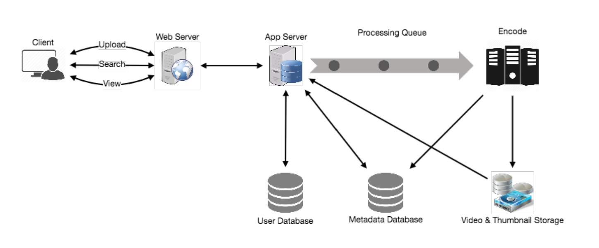

# 7.设计YouTube或Netflix

> **设计一个像 Youtube 这样的视频分享服务，用户可以上传/查看/搜索视频。 类似服务：netflix.com、vimeo.com、dailymotion.com、veoh.com** 
>
> **难度级别：中等**

## 1.为什么选择 YouTube？

YouTube 是世界上最受欢迎的视频分享网站之一。 该服务的用户可以上传、查看、分享、评价和反馈视频以及添加对视频的评论。

## 2.系统的要求和目标

为了这个练习，我们计划设计一个更简单版本的 YouTube，包含如下需求：

- **功能性需求：**
  - 1.用户能够上传视频。
  - 2.用户能够分享和观看视频。
  - 3.用户能够根据视频标题进行搜索。
  - 4.服务能够记录视频的统计数据，例如点赞数/点踩数、总观看次数等等。
  - 5.用户能够添加和查看视频评论。
- **非功能性需求：**
  - 1.系统应该是高可用的，上传的视频不应该丢失。
  - 2.系统应该是高可用的。 一致性可能会受到影响（为了可用性）; 如果用户有一段时间没有观看视频，那应该没问题。
  - 3.用户在观看视频时应该有实时体验，不应有任何延迟。
- **不在范围内的需求：**
  - 视频推荐、最受欢迎的视频、频道、订阅、稍后观看、 收藏夹等

## 3.容量估算和约束

假设我们有 15亿总用户，其中 8 亿日活用户。如果平均而言一个用户每天观看5个视频，那么每秒的总视频观看量将是：

```java
800M * 5 / 86400 sec => 46K videos/sec
```

现在估算上传：观看比率为 1:200，即对于每个视频上传，有 200 个视频观看，每秒上传 230 个视频。

```java
46K / 200 => 230 videos/sec
```

**存储估算：**

假设每分钟有 500 小时的视频上传到YouTube。如果平均而言，一分钟的视频需要 50MB 的存储空间（视频需要存储成多种格式），一分钟内上传的视频所需的总存储空间为：

```java
500 hours * 60 min * 50MB => 1500 GB/min（25 GB/sec）
```

这些数字是在忽略视频压缩和复制的情况下估算出来的，如果算上的话，需要重新估算。

**带宽估算：**

每分钟上传 500 小时的视频并假设每个视频上传需要 10MB/分钟的带宽，每分钟将有 300GB 的上传。

```java
500 hours * 60 min * 10MB => 300GB/min（5GB/sec）
```

假设上传与观看比率为 1:200，将需要 1TB/s 的传出带宽。

## 4.系统API

可以使用 SOAP 或 REST API 来暴露服务的功能接口。以下是上传和搜索视频的API定义：

```java
uploadVideo(api_dev_key, video_title, vide_description, tags[], category_id, default_language,recording_details, video_contents)
```

**参数：**

- `api_dev_key(string)`：注册账号的API开发者密钥。用于根据分配的配额限制用户。
- `video_title（string）`：视频的标题。
- `vide_description（string）`：视频的可选描述。
- `tags (string[])`：视频的可选标签。
- `category_id（string）`：视频的类别，例如电影、歌曲、人物等。
- `default_language(string)`：例如英语、普通话、印度语等。
- `recording_details（string）`：录制视频的位置。
- `video_contents（stream）`：要上传的视频。

**返回：（string）**
成功上传将返回 HTTP 202（已接受请求）并且视频编码完成后，通过电子邮件通知用户，其中包含访问视频的链接。还可以暴露一个查询的 API让用户知道他们上传的视频的当前状态。

```java
searchVideo(api_dev_key, search_query, user_location, maximum_videos_to_return,page_token)
```

**参数：**

- `api_dev_key(string)`：服务注册账号的API开发者密钥。
- `search_query(string)`：包含搜索词的字符串。
- `user_location（string）`：执行搜索的用户的可选位置。
- `maximum_videos_to_return (number)`：一个请求中返回的最大结果数。
- `page_token（string）`：此令牌将指定结果集中应返回的页面。

**返回：（JSON）**
 JSON包含有关与搜索查询匹配的视频资源列表的信息。每个视频资源包含视频标题、缩略图、视频创建日期和观看次数。

```java
streamVideo(api_dev_key, video_id, offset, codec, resolution)
```

**参数：**

- `api_dev_key(string)`：服务注册账号的API开发者密钥。
- `video_id（string）`：用于标识视频的字符串。
- `offset（number）`：我们应该能够从任何偏移量回到视频；这个偏移量将是一个从从视频开始时往后的时间。如果支持从多个设备播放/暂停视频，需要将偏移量存储在服务器上。这将使用户能够在离开任何一台设备后继续观看视频。
- `codec（string）&resolution（string）`：我们应该从 API 中发送编解码器和分辨率信息客户端支持从多个设备播放/暂停。想象一下，您正在电视的Netflix应用观看视频，暂停，然后开始在手机的 Netflix 应用上观看。在这种情况下，需要编解码器和分辨率，因为这两种设备具有不同的分辨率并使用不同的编解码器。

**返回: (STREAM)**

- 来自指定偏移量的流媒体（视频块）。

## 5.高阶设计

在高阶维度上，需要以下组件：

- 1.**处理队列**：每个上传的视频都会被推送到一个处理队列中去排队用于编码、缩略图生成和存储。
- 2.**编码器**：将每个上传的视频编码成多种格式。
- 3.**缩略图生成器**：为每个视频生成一些缩略图。
- 4.**视频和缩略图存储**：将视频和缩略图文件存储在一些分布式文件存储系统中。
- 5.**用户数据库**：用于存储用户的信息，例如姓名、电子邮件、地址等。
- 6.**视频元数据存储**：一个元数据数据库，用于存储有关视频的所有信息，例如标题、系统中的文件路径、上传用户、总浏览量、点赞数、点踩数等。也会用到存储所有视频的评论。

